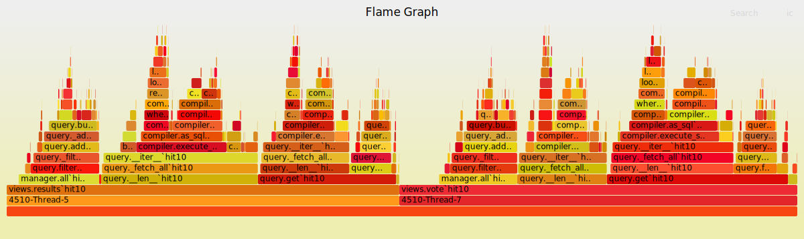

# pyliveupdate
`PyLiveUpdate` is a runtime python bytecode manipulation (e.g. bytecode instrumentation) framework for profiling, debugging and bugfixing Python programs.

PyLiveUpdate allows developers to profile, diagnose and fix production issues for Python programs without restarting the programs.

# Demo

[](https://asciinema.org/a/304465)

# Key features
* Profile specific Python functions' (by function names or module names) call time.
* Add / remove profilings without restart programs.
* Support profiling multiple processes / threads.
* Show profiling results with call summary and flamegraphs.
* More features are under developing. (Let us know what features you want: https://github.com/devopspp/pyliveupdate/issues/2)


# Quick start

## Compatibility
* Supports Python 3.5+ on Linux. 

## Install

```
pip install pyliveupdate
```
or
```
git clone https://github.com/devopspp/pyliveupdate.git
pip install -e pyliveupdate
```

## How to use
We currently implemented function profiling and are implementing more.
Please feel free to let us know if you find other features useful: https://github.com/devopspp/pyliveupdate/issues/2.

### profile function call time

1. Start pyliveupdate server
```
pylu-controller -l
```
2. In your program (like examples/program1.py) main module add 
```	
from pyliveupdate import UpdateStub
from pyliveupdatescripts import FP
UpdateStub().start()
```
3. Run your program (make sure in the correct directory)
```
cd examples
python program1.py
```
4. Start profile a set of functions
```
FP.profile(['__main__.**', 'module1.**'])
```
or
any functions
```
FP.profile('**')
```
6. List applied profiling
```
FP.ls()
```
7. Stop a profiling by its id without stopping your program
```
FP.revert(1)
```
8. Process the logs to generate a summary and a flamegraph
```
pylu-processlogs -i /tmp/pyliveupdate.log
```
9. View the generated call summary and flamegraph
#### Function call summary
The following summary gives in process `4510` thread `5`, `views.results` was called `10` times and each time takes `139 ms`, `views.results` called `manager.all` for `20` times.
```
4510-Thread-5
function  hit  time/hit (ms)
views.results 10  138.562
  -manager.all 20  14.212
    -__init__.__hash__ 10  0.035
    -manager.get_queryset 20  0.922
      -query.__init__ 20  0.616
        -query.__init__ 20  0.071
```
#### Flamegraph


### Profiling scope
  1. One specific function: `module1.class1.func1`
  2. All functions in a class: `module1.class1.*`
  3. All functions in a module: `module1.**`

`*` means one-level nesting, `**` means any level of nesting. 
# Known Users
Welcome to register your company/organization name here: https://github.com/devopspp/pyliveupdate/issues/1
